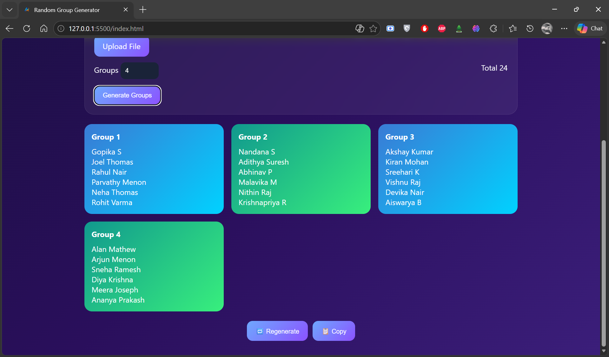
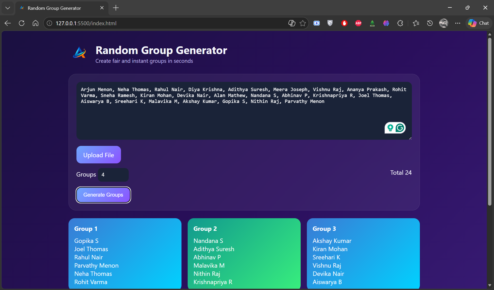
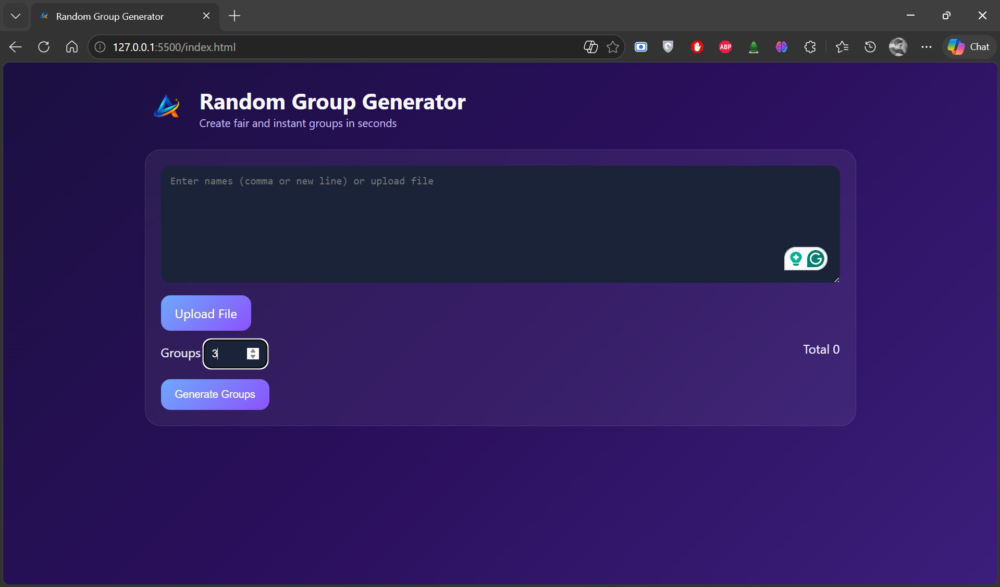

# Random Group Generator
A simple web tool to generate fair and random groups from a list of names. Designed for quick use during events, classroom activities, or team assignments.

## Features
- Enter names using:
  - Comma-separated format
  - New line format
- Upload file containing names
- Specify number of groups
- Automatically distribute members evenly
- Generate groups instantly
- Regenerate groups with one click
- Copy generated groups

## Tech Stack
- HTML  
- CSS  
- JavaScript  

## How to Run
1. Download or clone the repository
2. Open `index.html` in your browser

## Screenshots

## Notes

- Please do not reuse branding or logo without permission
